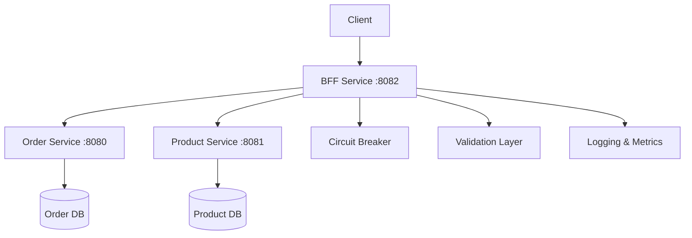

# BFF Service - Backend for Frontend

[](https://github.com/your-username/bff-service)
[](https://github.com/your-username/bff-service)
[](https://openjdk.java.net/projects/jdk/21/)
[](https://spring.io/projects/spring-boot)

A robust Backend for Frontend (BFF) service that orchestrates order processing across microservices in a 3D printing marketplace platform.

## 🎯 Overview

The BFF service acts as a facade for the order and product services, providing a unified API for order orchestration. It implements enterprise-grade patterns including circuit breakers, retry mechanisms, and comprehensive error handling.

### Key Features

- **Order Orchestration**: 4-step workflow for complete order processing
- **Circuit Breaker**: Fault-tolerant communication with downstream services
- **Input Validation**: Comprehensive validation with custom error responses
- **Async Processing**: Non-blocking request handling with CompletableFuture
- **Observability**: Health checks, metrics, and structured logging
- **AWS Ready**: Complete deployment automation with ECS/Fargate

## 🏗️ Architecture



### Order Flow

1. **Find Closest Supplier** - Identifies optimal supplier based on location
2. **Create Order** - Establishes order with supplier details
3. **Create Payment** - Initializes payment processing
4. **Execute Payment** - Completes payment and revenue splitting

## 🚀 Quick Start

### Prerequisites

- Java 21
- Docker (optional)
- Order Service running on port 8080
- Product Service running on port 8081

### Local Development

```bash
# Clone the repository
git clone https://github.com/your-username/bff-service.git
cd bff-service

# Run the service
./gradlew bootRun

# Test the health endpoint
curl http://localhost:8082/api/orders/health
```

### Docker

```bash
# Build the image
docker build -t bff-service .

# Run the container
docker run -p 8082:8082 bff-service
```

## 📋 API Documentation

### Create Order

**Endpoint:** `POST /api/orders`

**Request:**
```json
{
  "customerId": 123,
  "customerEmail": "john.doe@example.com",
  "productId": "3d-miniature-dragon",
  "quantity": 2,
  "stlFileUrl": "https://cdn.example.com/models/dragon.stl",
  "shippingAddress": {
    "firstName": "John",
    "lastName": "Doe",
    "street": "123 Innovation Drive",
    "city": "San Francisco",
    "state": "CA",
    "zipCode": "94105",
    "country": "United States",
    "phone": "+1-555-0123",
    "latitude": 37.7749,
    "longitude": -122.4194
  },
  "paymentInformation": {
    "method": "PAYPAL",
    "totalAmount": 75.99,
    "currency": "USD",
    "description": "3D Printed Dragon Miniature",
    "successUrl": "https://app.threedfly.com/orders/success",
    "cancelUrl": "https://app.threedfly.com/orders/cancel",
    "paymentMethodData": {
      "paypalEmail": "john.doe@example.com"
    }
  },
  "deliveryPreferences": {
    "deliverySpeed": "EXPEDITED"
  },
  "orderNotes": "Please use high-quality resin"
}
```

**Response (201 Created):**
```json
{
  "orderId": 1,
  "orderNumber": "ORD-1",
  "status": "PAYMENT_COMPLETED",
  "orderDate": "2025-01-11T10:30:00",
  "customer": {
    "customerId": 123,
    "email": "john.doe@example.com",
    "firstName": "John",
    "lastName": "Doe"
  },
  "payment": {
    "paymentId": 1,
    "status": "COMPLETED",
    "totalAmount": 75.99,
    "currency": "USD"
  }
}
```

### Health Check

**Endpoint:** `GET /api/orders/health`

**Response:**
```json
{
  "status": "UP",
  "service": "bff-service",
  "timestamp": "2025-01-11T10:30:00"
}
```

## 🧪 Testing

### Run All Tests

```bash
./gradlew test
```

### API Testing

```bash
# Run comprehensive API tests
./test-createorder-api.sh

# Run demo with sample scenarios
./demo-bff-service.sh
```

### Test Coverage

- **Unit Tests**: 16/16 passing
- **Integration Tests**: Complete API coverage
- **Validation Tests**: All edge cases covered
- **Circuit Breaker Tests**: Fault tolerance verified

## 🚢 Deployment

### AWS Deployment

```bash
# Set up AWS infrastructure
./scripts/setup-aws.sh

# Build and deploy to ECS
./scripts/build-and-deploy.sh

# Monitor deployment
./scripts/health-check.sh

# View logs
./scripts/view-logs.sh
```

### Environment Variables

```bash
# Service Configuration
BFF_ORDER_SERVICE_URL=http://order-service:8080
BFF_PRODUCT_SERVICE_URL=http://product-service:8081

# Circuit Breaker Settings
RESILIENCE4J_CIRCUITBREAKER_FAILURE_RATE_THRESHOLD=50
RESILIENCE4J_CIRCUITBREAKER_WAIT_DURATION_IN_OPEN_STATE=30s

# Monitoring
MANAGEMENT_ENDPOINTS_WEB_EXPOSURE_INCLUDE=health,metrics,circuitbreakers
```

## 📊 Monitoring

### Health Endpoints

- `/api/orders/health` - Service health check
- `/actuator/health` - Spring Boot health
- `/actuator/metrics` - Application metrics
- `/actuator/circuitbreakers` - Circuit breaker status

### Logging

The service provides structured logging with:
- Request/response correlation IDs
- Performance metrics
- Error tracking and stack traces
- Circuit breaker events

## 🔧 Configuration

### Circuit Breaker Settings

```yaml
resilience4j:
  circuitbreaker:
    instances:
      orderService:
        failureRateThreshold: 50
        waitDurationInOpenState: 30s
        slidingWindowSize: 10
      productService:
        failureRateThreshold: 50
        waitDurationInOpenState: 30s
        slidingWindowSize: 10
```

### Retry Configuration

```yaml
resilience4j:
  retry:
    instances:
      orderService:
        maxAttempts: 3
        waitDuration: 1s
        exponentialBackoffMultiplier: 2
```

## 🛠️ Development

### Project Structure

```
src/
├── main/
│   ├── java/com/threedfly/bff/
│   │   ├── controller/          # REST controllers
│   │   ├── service/             # Business logic
│   │   ├── dto/                 # Data transfer objects
│   │   ├── config/              # Configuration classes
│   │   └── entity/              # JPA entities
│   └── resources/
│       ├── application.properties
│       └── application-production.properties
├── test/
│   ├── java/                    # Unit and integration tests
│   └── resources/
└── scripts/                     # Deployment scripts
```

### Code Style

- Java 21 with records and pattern matching
- Spring Boot 3.2.1 with WebFlux
- Lombok for boilerplate reduction
- Comprehensive JavaDoc documentation

## 🤝 Contributing

1. Fork the repository
2. Create a feature branch (`git checkout -b feature/amazing-feature`)
3. Commit your changes (`git commit -m 'Add amazing feature'`)
4. Push to the branch (`git push origin feature/amazing-feature`)
5. Open a Pull Request

### Development Guidelines

- Write tests for all new functionality
- Follow existing code style and patterns
- Update documentation for API changes
- Ensure all tests pass before submitting PR

## 📝 License

This project is licensed under the MIT License - see the [LICENSE](LICENSE) file for details.

## 📞 Support

- **Issues**: [GitHub Issues](https://github.com/your-username/bff-service/issues)
- **Discussions**: [GitHub Discussions](https://github.com/your-username/bff-service/discussions)
- **Documentation**: [Wiki](https://github.com/your-username/bff-service/wiki)

## 🙏 Acknowledgments

- Spring Boot team for the excellent framework
- Resilience4j for circuit breaker implementation
- The 3DFly team for architecture guidance

---

**Built with ❤️ for the 3D printing community**