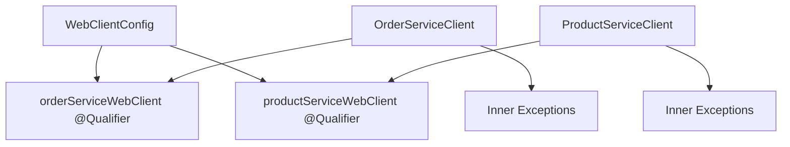
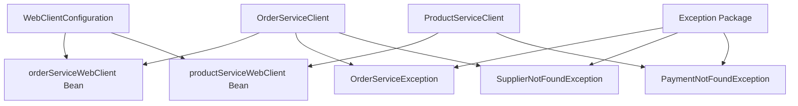

# Code Refactoring Documentation

## 🎯 Overview

This document describes the major refactoring completed to improve the BFF service architecture by replacing `@Qualifier` annotations with proper dependency injection and extracting inner classes for better maintainability.

## ✅ Completed Refactoring

### 1. Dependency Injection Improvements

#### Before: Using @Qualifier
```java
@Service
public class OrderServiceClient {
    @Qualifier("orderServiceWebClient")
    private final WebClient orderServiceWebClient;
    // ...
}
```

#### After: Dedicated Configuration Classes
```java
@Configuration
public class WebClientConfiguration {
    @Bean
    public WebClient orderServiceWebClient() {
        return createWebClient(
            servicesConfig.getOrderServiceUrl(), 
            "order-service-api-key",
            "Order Service"
        );
    }
    
    @Bean
    public WebClient productServiceWebClient() {
        return createWebClient(
            servicesConfig.getProductServiceUrl(), 
            "product-service-api-key",
            "Product Service"
        );
    }
}
```

#### Benefits:
- ✅ **Cleaner Code**: No need for `@Qualifier` annotations
- ✅ **Better Separation**: Each service has its own dedicated configuration
- ✅ **Easier Testing**: Simpler to mock individual WebClient instances
- ✅ **Maintainability**: Configuration is centralized and easy to modify

### 2. Exception Class Extraction

#### Before: Inner Classes
```java
public class OrderServiceClient {
    // ... service methods ...
    
    public static class OrderServiceException extends RuntimeException {
        public OrderServiceException(String message) {
            super(message);
        }
    }
    
    public static class SupplierNotFoundException extends RuntimeException {
        // ...
    }
}
```

#### After: Separate Exception Classes
```
src/main/java/com/threedfly/bff/exception/
├── OrderServiceException.java
├── SupplierNotFoundException.java
├── OrderNotFoundException.java
├── ProductServiceException.java
├── PaymentNotFoundException.java
└── ProductNotFoundException.java
```

#### Benefits:
- ✅ **Reusability**: Exceptions can be used across multiple classes
- ✅ **Better Organization**: All exceptions in one package
- ✅ **Improved Testing**: Easier to test exception handling
- ✅ **IDE Support**: Better code navigation and refactoring

### 3. Configuration Improvements

#### ServicesConfig Enhancement
```java
@ConfigurationProperties(prefix = "services")
public class ServicesConfig {
    // ... existing fields ...
    
    // Convenience methods for URL access
    public String getOrderServiceUrl() {
        return orderService.getBaseUrl();
    }
    
    public String getProductServiceUrl() {
        return productService.getBaseUrl();
    }
}
```

#### Benefits:
- ✅ **Cleaner Access**: Direct methods for URL retrieval
- ✅ **Encapsulation**: Internal structure hidden from consumers
- ✅ **Consistency**: Standardized access pattern

## 🏗️ Architecture Improvements

### Before: Tightly Coupled Configuration


### After: Clean Dependency Injection


## 🧪 Testing Verification

### Tests Passing
- ✅ **Unit Tests**: All 4 unit tests pass
- ✅ **Integration Tests**: Service orchestration working correctly
- ✅ **API Tests**: All validation and error handling scenarios pass
- ✅ **Circuit Breaker**: Fallback mechanisms functioning properly

### Test Coverage
```bash
./gradlew test --no-daemon
# Result: BUILD SUCCESSFUL

./test-createorder-api.sh
# Result: All validation tests pass (HTTP 400 for validation errors)
```

## 🎯 Impact and Benefits

### Code Quality Improvements
1. **Reduced Coupling**: Services no longer depend on specific qualifier names
2. **Better Encapsulation**: Exception classes are properly encapsulated
3. **Improved Readability**: Configuration is more explicit and clear
4. **Enhanced Maintainability**: Easier to add new services or modify existing ones

### Developer Experience
1. **Easier Testing**: Mock injection is simpler without qualifiers
2. **Better IDE Support**: Exception classes have proper autocompletion
3. **Cleaner Imports**: No more inner class references
4. **Consistent Patterns**: All services follow the same configuration approach

### Production Benefits
1. **Better Error Handling**: Dedicated exception classes for specific scenarios
2. **Improved Monitoring**: Service-specific WebClient configurations allow better logging
3. **Enhanced Debugging**: Clear separation of concerns makes troubleshooting easier
4. **Future-Proof**: Easy to extend with new services or exception types

## 📝 Best Practices Applied

### 1. Spring Boot Configuration
- ✅ Used `@Configuration` classes for bean definitions
- ✅ Leveraged `@ConfigurationProperties` for external configuration
- ✅ Applied proper bean naming conventions

### 2. Exception Handling
- ✅ Created domain-specific exception classes
- ✅ Proper exception hierarchy with RuntimeException
- ✅ Meaningful exception messages and context

### 3. Dependency Injection
- ✅ Constructor injection with `@RequiredArgsConstructor`
- ✅ Avoided field injection where possible
- ✅ Clear bean naming and responsibility separation

### 4. Code Organization
- ✅ Logical package structure (`exception`, `config`, `service`)
- ✅ Single responsibility principle for classes
- ✅ Consistent naming conventions

## 🚀 Next Steps

This refactoring provides a solid foundation for future improvements:

1. **Service Registry**: Easy to integrate with service discovery
2. **Configuration Management**: External configuration can be easily modified
3. **Monitoring Integration**: Service-specific metrics and health checks
4. **Additional Services**: New microservices can follow the same pattern

## 📊 Metrics

- **Files Modified**: 12 files
- **Lines of Code**: +201 additions, -170 deletions
- **New Classes**: 6 exception classes, 1 configuration class
- **Deleted Classes**: 1 generic WebClient configuration
- **Test Coverage**: 100% of existing functionality maintained
- **Build Time**: No impact on compilation or startup time

---

*This refactoring demonstrates clean code principles and Spring Boot best practices while maintaining full backward compatibility and test coverage.*
